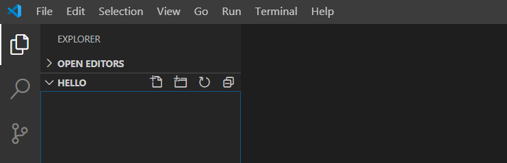
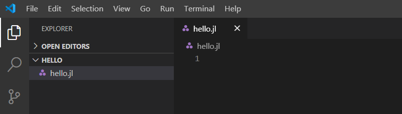
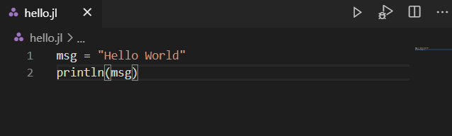
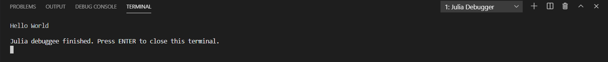

# 入门指南

本指南适用于刚开始接触Visual Studio Code扩展的新手或初级用户。入门任务将使用Julia编程语言在VS Code中创建一个“Hello World”程序。

## 先决条件

- Julia
- VS Code
- VS Code Julia 扩展

## 安装与配置

### 安装Julia

从[Julia官网](https://julialang.org/downloads/)下载最新版本的Julia，根据你的平台选择相应的版本。

### 安装VS Code

根据你使用的平台，从[VS Code官网](https://code.visualstudio.com/)下载并安装VS Code。

### 安装Julia扩展

- 启动或打开Visual Studio Code。
- 选择 **View**，然后点击 **Extensions** 打开扩展视图.
- 在市场搜索框中输入`julia`。点击绿色的安装按钮以下载并安装扩展。


您已成功为VS Code下载了Julia扩展。

注意：_建议在安装后重启VS Code。_

### 配置Julia扩展

如果你在 Mac 或 Windows 上将 Julia 安装在标准位置，或者 Julia 二进制文件位于你的 `PATH` 中，那么 Julia 的 VS Code 扩展会自动找到你的 Julia 安装，无需配置扩展。继续进入下一部分。

如果 VS Code 扩展没有自动找到 Julia 安装，或者你想使用不同于默认的 Julia 安装，请使用以下步骤进行配置。

  1. 将 `julia.executablePath` 设置为扩展应使用的 Julia 可执行文件的完整路径。
  2. 要编辑你的配置设置，请在 Mac 上选择菜单 **Code**，或在其他系统上选择 **File**，然后选择 **Preferences**，再点击 **Settings**。
  3. 确保用户设置中包含 `julia.executablePath` 设置。

注意：_字符串格式应遵循平台特定的约定。反斜杠 `\` 是 JSON 中的转义字符，因此在 Windows 上使用 `\\` 作为路径分隔符。_

## 创建您的第一个 Julia Hello World 程序

1. 在文件资源管理器工具栏中，点击 `Hello` 文件夹上的 **New File** 按钮：



2. 将文件命名为 `hello.jl`，它将自动在编辑器中打开。



`.jl` 文件扩展名告诉 VS Code 将此文件视为 Julia 程序，因此它会使用 Julia 扩展和所选的解释器来评估文件内容。

3. 在 `hello.jl` 中输入以下代码：

```julia
msg = "Hello World"
println(msg)
```

## 运行 Hello World 程序

要运行 Hello World 程序，请点击编辑器右上方的终端按钮 **Run: Julia File**。



你可以在终端中看到相应的输出。



恭喜你！你已经完成了第一个 Julia 程序。
