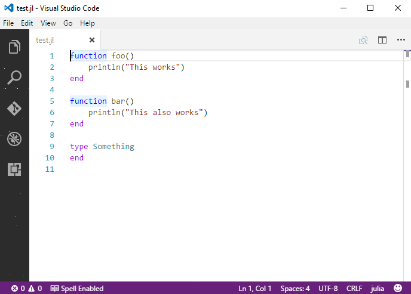

# 代码导航

## 快速文件导航

> **提示**：按住 `Ctrl+P` **(快速打开)** 以按名称打开任何文件。

有两个命令可以让用户轻松使用快捷键在文件内外进行导航。

- 按住 `Ctrl` 并按 `Tab` 可以查看在编辑器中打开的所有文件列表。
- 要打开其中一个文件，再次按 `Tab` 选择你想导航到的文件，然后释放 `Ctrl` 以打开它。

或者，你可以使用 `Alt+Left` 和 `Alt+Right` 在文件和编辑位置之间导航。如果你在同一文件的不同行之间跳转，这些快捷键可以让你轻松导航到这些位置。

## 打开包目录

### 跳转到定义

你可以按 `F12` 跳转到符号的定义。

如果你按住 `Ctrl` 并悬停在某个符号上，声明的预览将会出现：

> **提示**：你可以使用 `Ctrl+Click` 跳转到定义，或者使用 `Ctrl+Alt+Click` 在侧边打开定义。

### 跳转到符号

你可以使用 `Ctrl+Shift+O` 在文件内导航符号。输入 `:` 后，符号将按类别分组。按 `Up` 或 `Down` 键导航到你想要的位置。

### 按名称打开符号

你可以使用 `Ctrl+T` 按符号名称打开特定符号，无论它位于哪个文件中。输入你想导航到的符号名称，然后按 `Enter`。

