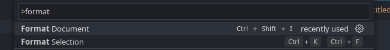

# 代码格式化
代码格式化由 [JuliaFormatter.jl](https://github.com/domluna/JuliaFormatter.jl) 提供支持。支持 `格式化文档` 命令（`Ctrl-Shift-I`）和 `格式化选择`（`Ctrl-K Ctrl-F`）。

默认的格式化设置相对保守且不具侵入性，但你可以在工作区中使用 `.JuliaFormatter.toml` 文件进行自定义。可以查看 [相关文档](https://domluna.github.io/JuliaFormatter.jl/stable/)。**注意：** 与 [JuliaFormatter.jl 的标准搜索规则](https://domluna.github.io/JuliaFormatter.jl/stable/config/#Configuration-File) 不同，VSCode 仅会检查工作区内的 `.JuliaFormatter.toml` 文件。

格式化有助于通过自动对齐缩进和空格来保持代码的可读性。

Julia 格式化工具可以自动将以下代码：
```julia
f(x)=2x+3
print(f'( 2 ))

open("myfile.txt", "w") do io
	write(io, "Hello world!")
    end;
```

格式化为：
```julia
f(x) = 2x + 3
print(f'(2))

open("myfile.txt", "w") do io
    write(io, "Hello world!")
end;
```

代码保持不变，但后者更易于阅读。

要格式化代码，请按 `Shift + Cmd | Windows + P` 打开命令面板，然后搜索`Format Document`


