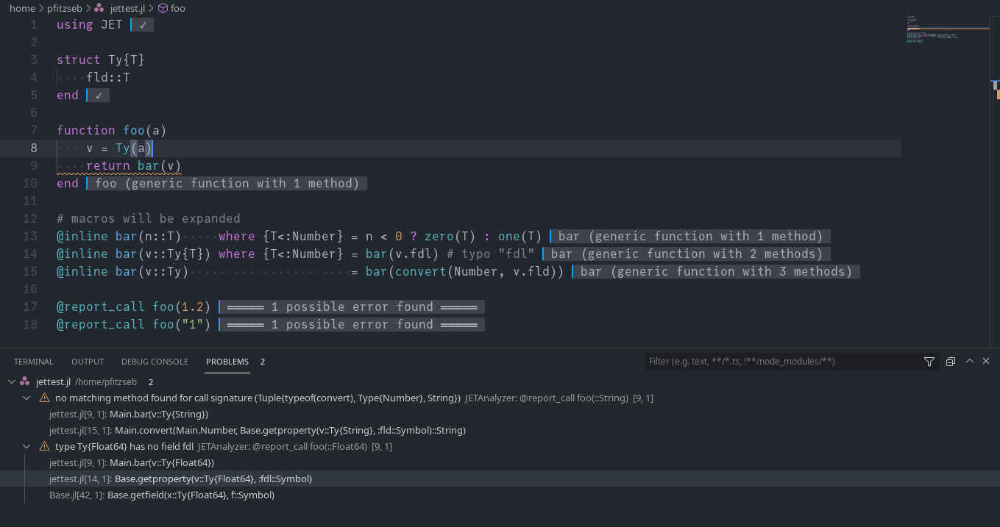

# 代码检查与诊断

工作区中的所有 Julia 代码都会进行静态检查。您可以通过 `julia.lint.run` 设置禁用此功能，或通过各种带 `julia.lint.` 前缀的选项来配置它。

## 运行时诊断

像 [JET.jl](https://github.com/aviatesk/JET.jl) 这样的包可以在运行时分析代码（在某种意义上的“运行时”）：

您可以通过 `julia.showRuntimeDiagnostics` 设置选择关闭此功能。使用 `Julia: Clear Runtime Diagnostics` 或  `Julia: Clear Runtime Diagnostics by Provider` 清除显示的诊断信息。

希望使用此功能的包作者可以简单地实现一个支持 `application/vnd.julia-vscode.diagnostics` MIME 类型的类型。有关 API 的更多信息，请检查集成的 Julia REPL 中的 `VSCodeServer.DIAGNOSTIC_MIME`。
