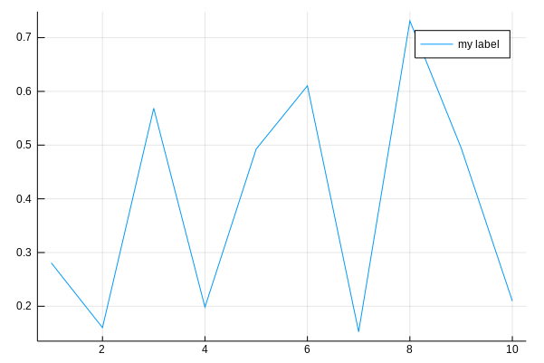

# 绘图

Julia 的 `Plots` 提供了创建数据可视化的能力。

## 安装 `Plots` 包


首先，打开 Julia 终端（也称为 REPL），您可以按照 [这里](https://www.julia-vscode.org/docs/stable/userguide/runningcode/#The-Julia-REPL-1) 的步骤进行操作。

在 REPL 窗口的 Julia 提示符下，输入以下内容：
```julia-repl
julia> using Pkg
```
这将告诉 Julia 您将使用包管理器。

然后输入以下内容以添加 `Plots` 包：
```julia-repl
julia> Pkg.add("Plots")
```
## 创建可视化

**记得**保持 REPL 打开，因为程序的任何输出都将在此处打印。

您需要执行的第一段代码是：
```julia
using Plots
```
这告诉 Julia 加载我们将用于创建可视化的库。

### 示例

让我们通过一个简单的程序来理解这一点：

编写以下代码：
```julia
using Plots
x = 1:10; y = rand(10); # These are the plotting data
plot(x,y, label="my label")
```

现在运行这段代码，您可以按照 [这里](https://www.julia-vscode.org/docs/stable/userguide/runningcode/#Running-code-in-the-Julia-REPL-1) 的步骤进行操作。

您将会在 VS Code 中的新标签页中获得如下图形的输出：

