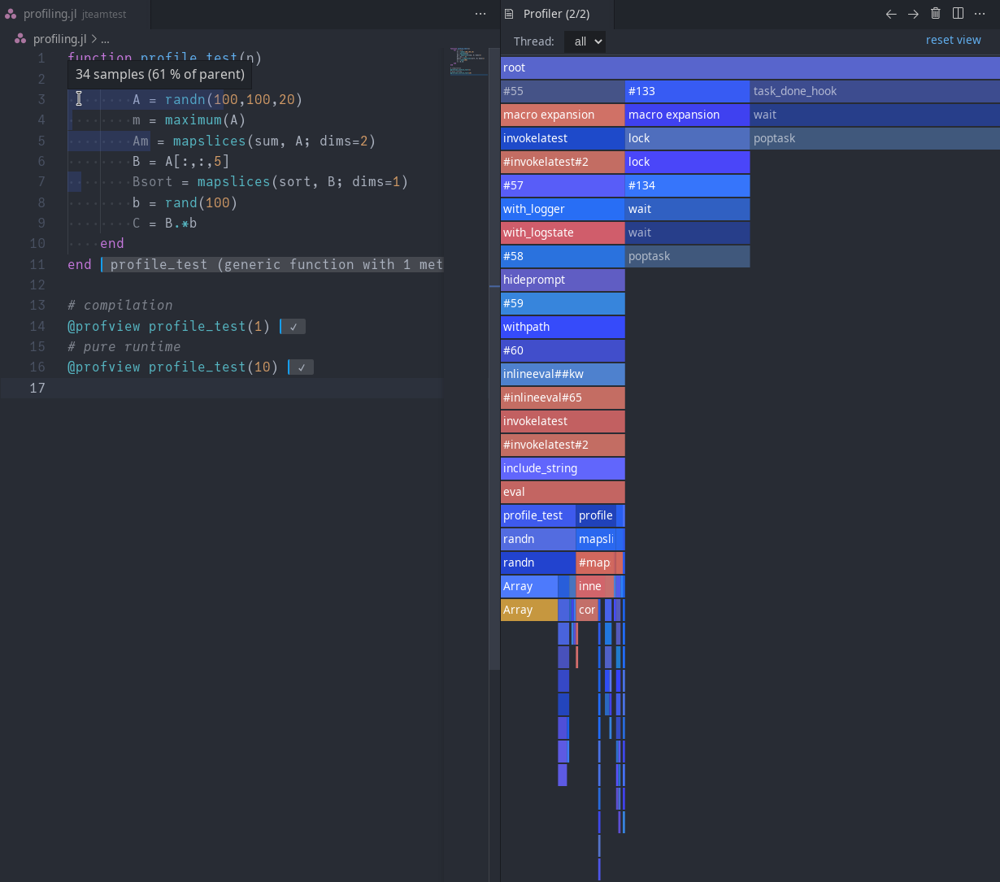
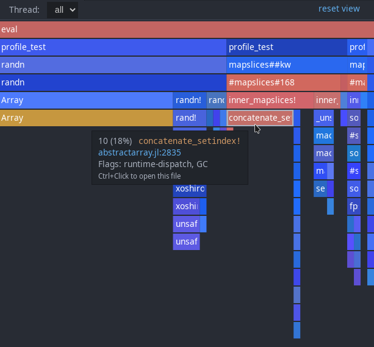
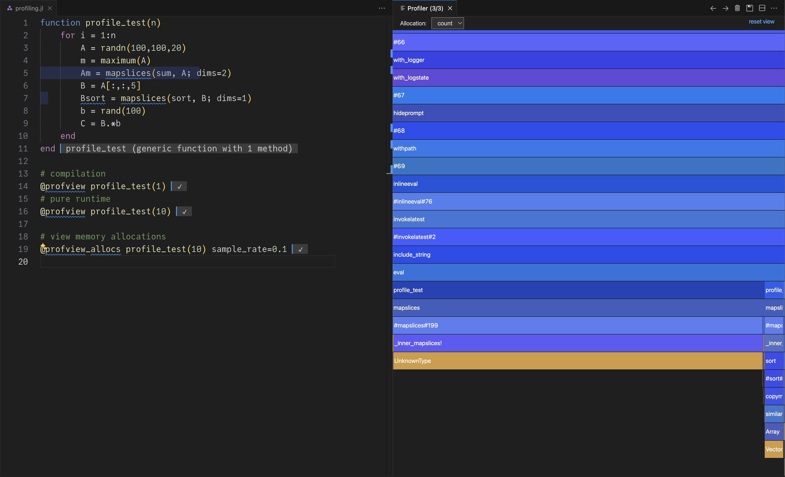

# 代码分析

Julia 自带 [采样分析器](https://docs.julialang.org/en/v1/stdlib/Profile/)，用于测量函数中消耗的 CPU 时间或分配的数量和大小。还有 [各种包](https://github.com/timholy/FlameGraphs.jl) 可用于可视化这些分析跟踪。

VS Code 扩展提供了实用的宏 `@profview` 和 `@profview_allocs` 来运行这些分析器，并配有自己的分析查看器。分析来自 [ProfileView.jl 说明文档](https://github.com/timholy/ProfileView.jl) 的示例函数：
```julia
function profile_test(n)
    for i = 1:n
        A = randn(100,100,20)
        m = maximum(A)
        Am = mapslices(sum, A; dims=2)
        B = A[:,:,5]
        Bsort = mapslices(sort, B; dims=1)
        b = rand(100)
        C = B.*b
    end
end

# compilation
@profview profile_test(1)
# pure runtime
@profview profile_test(10)
```
会显示一个火焰图和内联注释：


点击火焰图中的任何元素会放大该元素；双击背景（或使用右上角的 `reset view` 按钮）将恢复初始视图。`Ctrl-Click ` 以打开引用的文件。

工具提示将告诉您在某一帧中收集的样本数量以及最上面显示帧的百分比。有一些启发式标志，如垃圾回收、动态调度等（这些也有颜色编码）。



内联视图显示父帧的样本来自于哪一行（并在悬停在内联注释的开始时显示标志，如上所述）：


分配分析器工作类似，但显示的是分配的数量或大小，而不是函数中消耗的时间：

```julia
@profview_allocs profile_test(10) sample_rate=0.1
```



火焰图上方的菜单允许您在分配数量和分配大小之间切换。

请注意，可选参数 `sample_rate` 可用于调整收集的样本数量。样本率为 1.0 将记录所有内容；0.0 将不记录任何内容。请谨慎使用，因为较大的值可能会显著减慢代码运行速度。默认值为 0.0001；如果您知道正在发生分配但未看到有用的信息，可以逐渐增加该值。