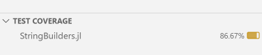

# 测试项框架

测试项框架(test item framework)是一组软件包和用户界面功能，使编写和运行 Julia 软件包的测试变得简单。

该框架的主要好处在于，测试代码可以结构化为测试项，从而可以单独轻松运行这些测试项。

Julia VS Code 扩展对测试项框架提供了广泛支持，但测试项框架本身可以完全独立于 VS Code 使用。用户可以编写测试项并通过命令行界面（或标准的 `Pkg.test` 功能）运行它们，而无需使用 VS Code。

## 编写测试项

测试项框架的核心功能是可以将测试结构化为 `@testitem` 块，然后单独运行这些测试，而无需一次性运行所有测试。一个典型的 `@testitem` 可能如下所示：

```julia
@testitem "First tests" begin
    x = foo("bar")

    @test length(x)==3
    @test x == "bar"
end
```

一个 `@testitem` 总是有一个名称（此处为 "First tests"），然后是一个 `begin ... end` 块中的代码。`@testitem` 内部的代码必须能够独立执行，即不能依赖于 `@testitem` 外部的代码，除非该代码以某种方式被显式导入或包含在 `@testitem` 内部。有一个例外：`@testitem` 内的代码将在一个临时模块内运行，其中已经执行了 `using Test` 和 `using MYPACKAGENAME`，因此可以直接使用从 `Test` 模块或正在开发的软件包中导出的任何内容。在上面的例子中，这适用于 `foo` 函数（假设在被测试的软件包中定义）和 `@test` 宏。

`@testitem` 可以在包中的任何地方出现。它们不必位于 `test` 文件夹中，也不必在 `test/runtests.jl` 包含的文件中。事实上，`@testitem` 甚至可以位于常规包代码内部，例如与正在测试的代码相邻。在这种情况下，您只需依赖于 [TestItems.jl](https://github.com/julia-vscode/TestItems.jl) 包，以便访问 `@testitem` 宏。如果您有一个名为 `MyPackage` 的包，则文件 `src/MyPackage.jl` 可以如下所示：

```julia
module MyPackage

using TestItems

export foo

foo(x) = x

@testitem "First tests" begin
    x = foo("bar")

    @test length(x)==3
    @test x == "bar"
end

end
```

如果您不喜欢这种内联的 `@testitem` 风格，也可以将 `@testitem` 块放入测试文件夹中的 Julia 文件中。

## 在 VS Code 中运行测试项

当您在 VS Code 中打开一个 Julia 包并安装了 [Julia 扩展](https://www.julia-vscode.org/) 时，它会不断（每次按键后！）查找您 Julia 文件中的所有 `@testitem`。如果找到任何 `@testitem`，它们将出现在用户界面的各个位置。

您可以在 VS Code 的测试活动栏中找到所有检测到的 `@testitem`：


测试活动区域提供了运行单个 `@testitem`、查看结果等的选项。

S Code 还会在文本编辑器中每个检测到的 `@testitem` 旁边放置一个小的运行按钮：


除了所有这些允许您运行测试的 UI 元素之外，还有用于显示测试结果的 UI。例如，当您运行测试并且其中一些测试失败时，扩展将收集所有这些测试失败信息，并在代码中直接显示特定测试失败的位置：


特别是在运行大量测试且测试文件较大时，这使得找到具体失败测试变得更加容易，不再需要在 REPL 中寻找文件和行信息！

## 从命令行运行测试

您可以使用 [TestItemRunner.jl](https://github.com/julia-vscode/TestItemRunner.jl) 包作为传统 `Pkg.test` 工作流的一部分来运行 `@testitem`。

要为使用 `@testitem` 的包启用与 `Pkg.test` 的集成，您只需做两件事：

1) 将 [TestItemRunner.jl](https://github.com/julia-vscode/TestItemRunner.jl) 作为测试依赖项添加到您的包中
2) 在包的 `test/runtests.jl` 文件中放入以下代码：

```julia
using TestItemRunner

@run_package_tests
```

## 标签

现在您可以为 `@testitem` 添加标签。标签可以在 VS Code UI 和通过 [TestItemRunner.jl](https://github.com/julia-vscode/TestItemRunner.jl) 中使用，以过滤您想要运行的测试项。

添加标签的语法如下：
```julia
@testitem "My testitem" tags=[:skipci, :important] begin
    x = foo("bar")

    @test length(x)==3
    @test x == "bar"
end
```

然后，您可以使用这些相同的标签在 VS Code UI 中过滤测试列表：


您还可以在 `test/runtests.jl` 中使用标签，以过滤将通过传统 `Pkg.test` 入口点运行的测试列表：

```
using TestItemRunner

@run_package_tests filter=ti->!(:skipci in ti.tags)
```

下面的 [[#TestItemRunner.jl 中的过滤支持]] 部分对 `@run_package_tests` 宏的新过滤关键字进行了更完整的描述。

## 在 VS Code 中并行执行测试

VS Code 扩展有一个设置，控制您想要使用多少 Julia 进程进行并行测试执行：


默认值为 `1`，因此您需要更改此值以使用并行测试执行功能。值为 `0` 将使用与您的处理器数量相同的测试进程。

一旦您配置了多个测试进程，单个 `@testitem` 将并行运行。

这里有一个权衡：更多的测试进程意味着需要更多内存，并且可能还会有额外的开销来启动所有进程并准备好实际运行 `@testitem`。

## 管理测试进程

通过 VS Code 中的新测试 UI 启动的测试进程不会自动终止，即它们会保持在内存中并占用其他资源。当然，这样做有很多好处，即 `@testitem` 可以在测试进程启动并运行后非常快速地执行，但在某些情况下，人们可能仍希望简单地终止所有当前正在运行的测试进程。

为了实现这一点，所有测试进程会在 Julia 工作区中显示，旁边还有任何可能正在运行的 REPL 或 Notebook 进程。您可以通过点击 `Stop Test Process` 按钮来终止 Julia 测试进程。在这个截图中，有四个测试进程正在运行：

## TestItemRunner.jl 中的过滤支持

您可以将通用过滤函数传递给 `@run_package_tests` 宏，以选择要执行的 `@testitem`。上面的部分使用标签来选择要运行的测试，但您还可以根据 `@testitem` 定义的文件名或 `@testitem` 的名称进行过滤。

工作原理是，您可以将过滤函数传递给 `@run_package_tests` 宏。该过滤函数会针对项目中检测到的每个 `@testitem` 被调用一次，函数必须返回 `true`（如果该测试项应运行）或 `false`（如果不应运行）。`@run_package_tests` 将传递一个包含三个字段的命名元组给您的过滤函数，这些字段包含有关特定测试项的元信息，分别是字段 `filename`（定义 `@testitem` 的文件完整路径）、`name`（您定义的 `@testitem` 名称）和 `tags`（一个 `Symbol` 的向量）。通过这些信息，您可以编写任意复杂的过滤条件。例如，这里我过滤掉任何具有 `:skipci` 标签的 `@testitem`，并且我只运行在特定文件中定义的测试：
```julia
@run_package_tests filter=ti->( !(:skipci in ti.tags) && endswith(ti.filename, "test_foo.jl") )
```

## 默认导入选项

当您编写 `@testitem` 时，默认情况下，正在测试的软件包和 `Test` 包通过一个隐式的 `using` 语句导入。在某些情况下，这可能不是您希望的，因此可以通过 `default_imports` 选项在每个 `@testitem` 级别上控制此行为，该选项接受一个 `Bool` 值。要禁用这些默认导入，您可以这样写：
```julia
@testitem "Another test for foo" default_imports=false begin
    using MyPackage, Test

    x = foo("bar")

    @test x != "bar"
end
```

注意，我们现在需要手动在 `@testitem` 中添加行 `using MyPackage, Test`，以便访问 `foo` 函数和 `@test` 宏。

## 在 `@testitem` 之间共享代码

默认情况下，`@testitem` 之间不共享任何代码，且彼此之间没有依赖关系。这些特性使得独立运行 `@testitem` 成为可能，但有时需要在多个 `@testitem` 之间共享公共代码。测试项框架提供了两个宏来实现这一目的：`@testsnippet` 和 `@testmodule`。这两个宏可以出现在包中的任何 `.jl` 文件中。

### 测试片段

`@testsnippet` 是一个代码块，单个 `@testitem` 可以在其自己的代码运行之前执行该代码块。如果某个 `@testitem` 依赖于特定的 `@testsnippet`，那么该片段将在每次运行 `@testitem` 时执行。

`@testsnippet` 的定义可能如下所示：
```julia
@testsnippet MySnippet begin
    foo = "Hello world"
end
```

`@testitem` 可以通过使用 `setup` 关键字来利用这个片段，如下所示：
```julia
@testitem "My test item" setup=[MySnippet] begin
    @test foo == "Hello world"
end
```

### 测试模块

`@testmodule` 定义了一个可以从 `@testitem` 访问的 Julia 模块。这样的模块在每个 Julia 测试进程中只会运行 _一次_。例如，如果两个 `@testitem` 依赖于同一个 `@testmodule`，它将只被运行一次，然后整个模块将对两个 `@testitem` 可用。

`@testmodule` 的定义可能如下所示：
```julia
@testmodule MyModule begin
    foo = "Hello world"
end
```

`@testitem` 可以再次使用 `setup` 关键字来利用这个模块。与 `@testsnippet` 不同的是，`@testmodule` 的内容在一个常规的 Julia `module` 中运行，因此要访问其中的内容，需要在测试模块定义的名称前加上模块名。利用刚刚定义的 `@testmodule` 的 `@testitem` 可能如下所示：

```julia
@testitem "My test item" setup=[MyModule] begin
    @test MyModule.foo == "Hello world"
end
```

注意我们在这里用表达式 `MyModule.foo` 访问 `foo`。

>[!note]
>笔者发现，即使 `@testmodule` 使用 `export` 导出 `foo` 函数，`@testitem` 仍然不能识别 `foo`，且需要附加模块名。

## `@testitem` 的调试

可以通过 `Debug Test` 命令在调试器中运行 `@testitem`。这个命令可以在 VS Code UI 的多个地方访问。可以在测试主视图中找到：  


你也可以右击文本编辑器中的运行测试图标，选择调试选项：


当在调试器中运行测试项时，可以在被测试的代码或 `@testitem` 本身设置断点，然后利用 Julia VS Code 调试器的所有常规功能。

## 代码覆盖率

在 Julia 1.11 及更高版本中，可以在代码覆盖模式下运行测试项，并直接在 VS Code 中显示代码覆盖结果。

要以代码覆盖模式运行测试项，可以使用 `Run Tests with Coverage` 命令启动。该命令在主测试视图：


和文本编辑器的右键菜单中都可用：


覆盖率结果会以多种方式在 VS Code UI 中显示。例如，总结视图显示每个文件的覆盖情况：



可以在文本编辑器中看到详细的行覆盖信息：


覆盖率结果还会在 VS Code UI 的常规资源管理器部分内联显示。
