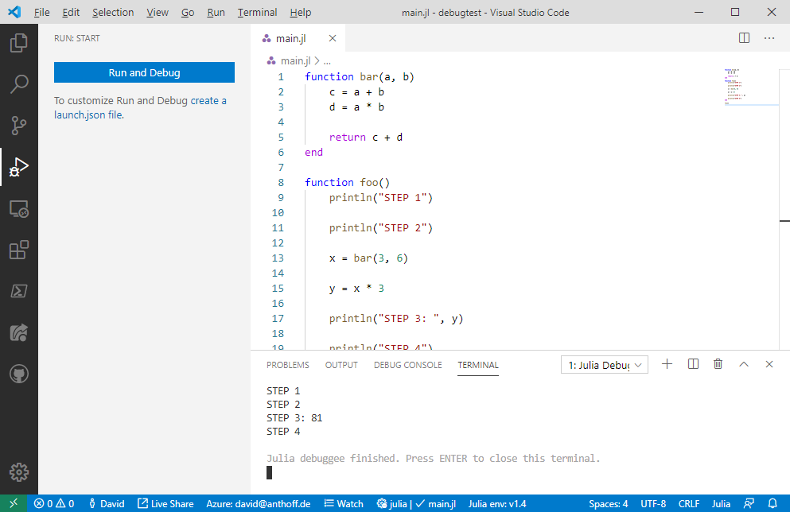
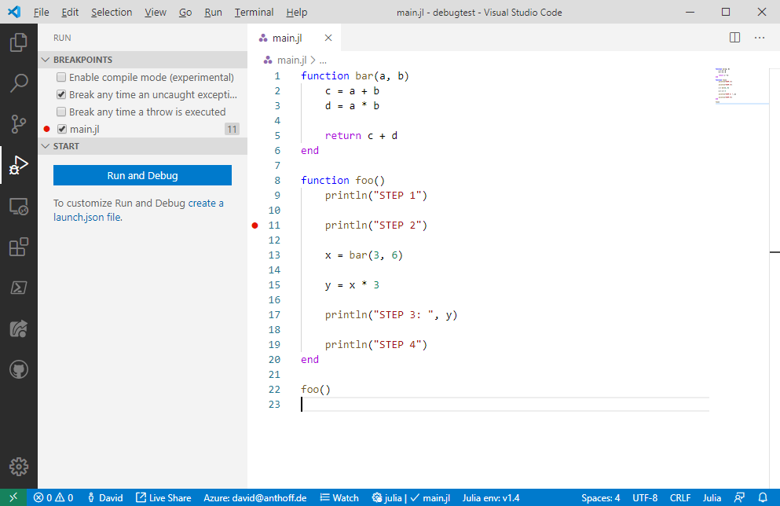
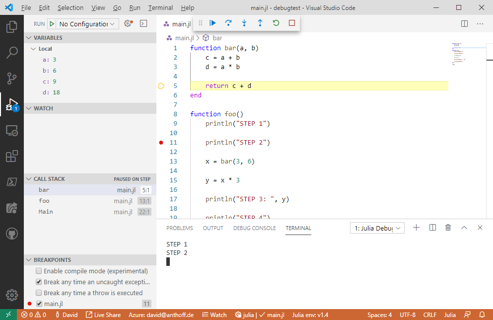
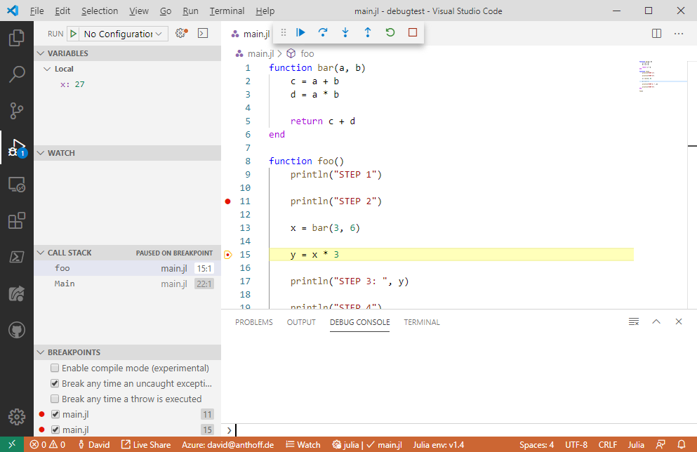
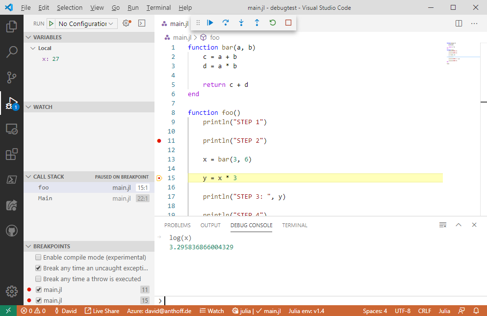
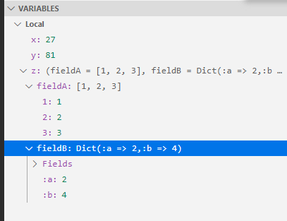
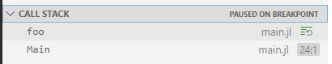
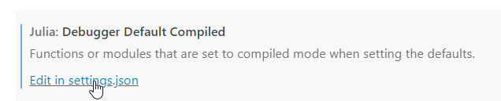

# 调试

Julia 扩展支持Julia 程序和应用的所有类型的调试。

有关检查变量、设置断点等与语言无关的一般调试功能，请查看 [VS Code 调试](https://code.visualstudio.com/docs/editor/debugging)。

## 示例
1. 在 VS Code 中打开一个 Julia 文件。
2. 点击 **run** 按钮。您将看到默认的调试器启动面板：
3. 点击 **run and debug**（或选择 `F5`）以在调试器中运行当前活动的 Julia 文件。输出将在 Julia 调试终端中显示。



在此例中，整个程序一次性运行并完成，没有出现问题。让我们通过在第 11 行设置一个断点来使这个示例更有用。我们只需在代码编辑器的最左侧列上单击即可：



红点表明我们现在已经设置了一个断点。接下来，我们重新启动程序（可以通过单击 `run and debug` 或按 `F5`）。当程序到达第 11 行时，它将暂停：


黄色行显示了如果继续运行程序将要执行的位置。我们还可以查看调用堆栈的位置和所有断点的列表。在文本编辑器顶部，我们现在看到一个工具条，包含常用调试操作的命令：`Continue`, `Step over`, `Step Into`, `Step Out` 等。 让我们单击一次 `Step Over` 然后单击 `Step Into`。我们现在在 `bar` 函数的第一行暂停：


 `Variables` 视图现在显示我们在此函数中拥有的局部变量及其当前值。当我们逐步执行程序并最终到达 `bar` 函数的末尾时，局部变量的列表变得更长，即我们现在还可以看到 `c` 和 `d` 的值：



让我们在第 15 行再设置一个断点，然后继续程序直到它到达该断点。然后我们单击 `Debug Console`，看到如下视图：



在此视图中，我们可以在当前函数的变量环境中计算任意合法的 Julia 代码。例如，我们可以通过运行 `log(x)` 来计算变量 `x` 的对数值：



我们还可以在程序暂停时更改任何局部变量的值。例如，要更改 `x` 的值，我们可以在 `Variables` 窗口双击 `27` 旁边的 `x`，然后输入任意合法的 Julia 表达式。该表达式返回的值将成为 `x` 的新值。在以下示例中，我们将 `x` 的值更改为字符串：


这就完成了非常基础的演示。接下来我想强调一些其他功能。

### 启动调试器的方式

有两种不同的方式可以启动调试器：
- 一种是您在演示中已经学到的：您在调试器中运行一个 Julia 文件。
- 第二种允许您在交互式 REPL 中调试代码。

### 运行 Julia 文件

在我们的示例中，我们在调试器中启动了当前打开的 Julia 文件。这是启动调试器的最基本方式，但还有许多其他选项可以在 VS Code 的 `launch.json` 文件中配置。示例包括固定某个 Julia 文件为启动文件、配置命令行参数等。有关 `launch.json` 功能的更多详细描述，请参见 VS Code 调试文档。

### 从 REPL 调试代码

用户可以在 REPL 中启动调试器。在这种情况下，调试器将附加到已经运行的 REPL 环境。要这样启动调试器，需要在 REPL 中使用两个宏：`@enter` 和 `@run`。这两个宏都非常简单：它们将在传递给宏代码上启动调试器。`@run` 将在遇到断点时运行代码，而 `@enter` 将在代码的第一行暂停调试器。例如，您可以通过输入 `@enter println("Test")` 来调试 `println` 函数。

### 断点

您已经学会了如何轻松地在源代码中设置断点。还有两种关于断点的选项： 函数断点和条件断点。

### 函数断点

如果您在 `BREAKPOINTS` 视图中单击小 `+` 按钮，您可以添加一个函数断点。只需输入您希望断点的函数名称即可。您还可以通过指定函数签名，例如 `foo`(:: String, ::Number)，来配置仅在特定方法上暂停运行。

### 条件断点

如果您在编辑器中右键单击一个断点，您可以选择 `Edit breakpoint...` 选项，然后可以为该断点添加条件。您可以在此处输入任何返回 `Bool` 值的有效 Julia 表达式。您当然可以在此表达式中完全访问所有局部变量。

### 变量查看器

复合变量、数组和字典在变量查看器中具有完整的树状下拉支持：



### 监视部分


监视部分允许您输入任意 Julia 表达式，这些表达式将在程序暂停时进行计算并显示结果：


### 调用堆栈

调用堆栈部分允许您查看任何堆栈帧的内容，即当您单击另一个函数时，它将显示所选堆栈帧的局部变量。您还可以通过单击此处给定条目旁的小重启图标重新启动代码执行：



请注意，这最后一项功能可能比较脆弱，特别是当您的函数修改任何全局状态时。

### 异常

如果您的代码引发异常，您将看到一个漂亮的异常视图：

您还可以在 UI 的 BREAKPOINTS 部分配置调试器在异常发生时的行为。

### 编译模式

断点视图还有一个选项称为启用编译模式：


**此选项的功能如下：**

如果您选择此选项，则在当前堆栈帧中调用的任何函数中设置的断点将不再暂停代码执行。在我们的示例中，如果您在函数 `foo` 中暂停，然后选择此选项，`bar` 中的断点将不再暂停执行。`foo` 中的断点仍将暂停调试器。

**您为什么会想使用此功能？**

启用此选项后，您的代码将运行得更快。

>[!important]
>这个功能的使用实践，应该执行。
### 故障排除

如果您在使用调试器时遇到任何问题，请随时在 [Julia VS Code](https://github.com/julia-vscode/julia-vscode) 存储库中告知我们。

## ## 加速调试的设置
### `ALL_MODULES_EXCEPT_MAIN`
为了使调试器运行得更快，我们希望最小化被解释的包/模块数量。 假设您需要调试您编写的代码，但也需要使用包 `Statistics` 提供的功能。 单击调试器默认编译扩展设置。


将此设置配置如下：
```json
"julia.debuggerDefaultCompiled": [    
        "ALL_MODULES_EXCEPT_MAIN",   
        "-Statistics.",     
    ]
```
`ALL_MODULES_EXCEPT_MAIN` 将使所有模块以编译模式运行，除了包含您编写代码的 Main 模块。我们还使用 `"-Statistics."` 将此模块及其所有子模块从编译模块列表中移除，以便它们将被解释。

### 使用自定义 sys 镜像
调试时也可以使用自定义的 Julia sys 镜像。转到 julia-vscode 扩展设置并单击编辑`Additional Args`。


Once in the settings, use "-J" option followed by your path to the custom sys image. Note this "Additional Args" settings are currently used only when debugging in the REPL mode, see the `@run` macron in the example bellow.进入设置后，使用 `"-J"` 选项，后跟自定义 sys 镜像的路径。请注意，此 `Additional Args` 设置当前仅在 REPL 模式下调试时使用，参见下面的 `@run` 宏示例。
```json
"julia.additionalArgs": [
        "-JC:\\temp\\sys_custom.so",
    ],
```
### 快速调试示例

在以下代码中，我们使用了 `GLMakie` 和 `Statistics` 包。`GLMakie` 是一个绘图库，已知在 Julia 1.9 之前的版本中首次绘图的时间（TTFP）相对较慢。在调试时，解释 `GLMakie` 显然不是我们想要的事情。通过上述设置，`GLMakie` 被设置为以编译模式运行，我们还从 sys 镜像加载它。确保您在 REPL 模式下使用 `@run` 宏与您的根函数进行调试。


当调试器到达指定的代码行时，我们可以进入 `mean` 函数（来自 `Statistics` 包）并在其中进行调试。


