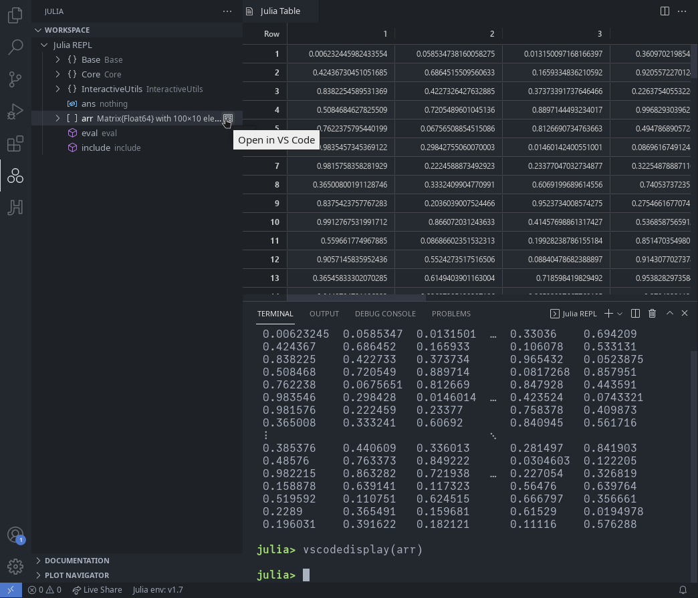

# 表格查看器

所有兼容 [Tables.jl](https://github.com/JuliaData/Tables.jl) 的表格（以及更多！）都可以在集成的表格查看器中显示。

你可以使用导出的 `vscodedisplay` 函数直接显示对象，或者在工作区中使用 `Open in VS Code` 按钮：

`vscodedisplay` 还接受一个可选的第二个参数，可以设置标签页标题。

表格可以在用户界面中进行过滤和排序，尽管对于中等大小的表格，这可能会比较慢，而对于大表格（超过 1e7 个元素）则会被禁用。

请注意，按照上述定义，非大表格是被缓存的。因此，原始数据结构的更改在再次显示表格之前不会反映在表格查看器中。

一个稍微隐藏的功能是，你可以选择行并使用 Ctrl-C 或上下文菜单将其复制到剪贴板。请注意，当选择多行时，这将会比较慢。
