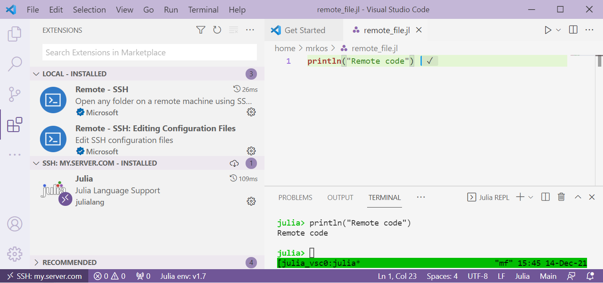
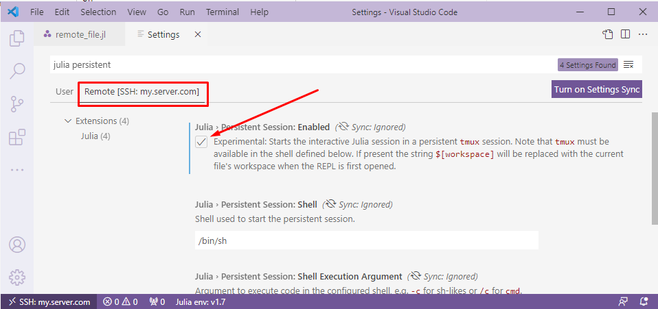

# 远程开发

要在远程服务器上执行代码，你需要：

1. 确保你有 SSH 访问服务器权限。
2. 在本地 VS Code 中安装 [Remote-SSH](https://marketplace.visualstudio.com/items?itemName=ms-vscode-remote.remote-ssh) 扩展。
3. 连接 VS Code到服务器 (使用 VS Code 窗口左下角的图标:  )
4. 通过 VS Code 在服务器上安装 [Julia 扩展](https://marketplace.visualstudio.com/items?itemName=julialang.language-julia)

然后，你可以像在本地一样在服务器上执行代码：

## 持久化服务器会话

当你关闭 VS Code 窗口时，服务器端的 REPL 默认会终止。要使 REPL 状态在会话之间保持持久，你需要：

1. 在服务器上安装 `tmux`，[一个终端复用器](https://www.ocf.berkeley.edu/~ckuehl/tmux/)（例如，通过 `apt install tmux`）
2. 在 VS Code 设置中切换 `julia.persistentSession.enabled` 设置。请注意，此设置仅在 Julia 扩展的服务器安装中可用，可以通过设置的 "Remote ..." 选项卡访问：

